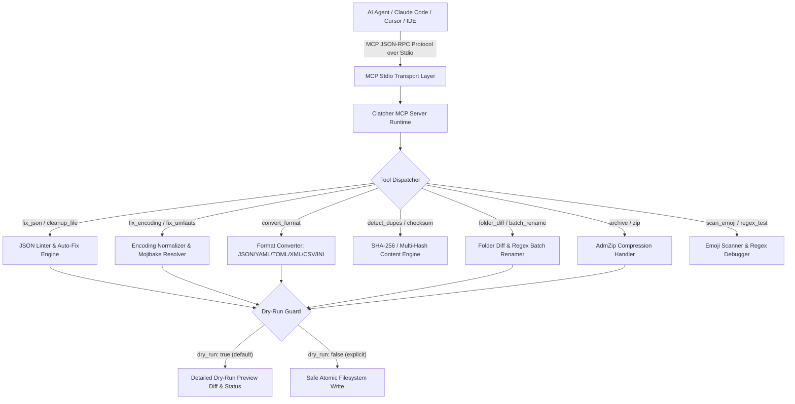
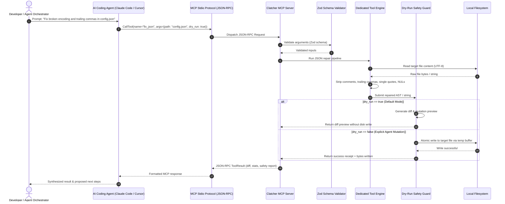

<p align="center">
  
</p>

# ellmos-clatcher-mcp

**🇩🇪 [Deutsche Version](README_de.md)** | **🛡️ [Security Policy](SECURITY.md)** | **📜 [Licenses](THIRD_PARTY_LICENSES.md)** | **📝 [Changelog](CHANGELOG.md)** | **📋 [llms.txt](llms.txt)**

[](https://www.npmjs.com/package/ellmos-clatcher-mcp)
[](https://opensource.org/licenses/MIT)
[](https://nodejs.org/)
[](https://github.com/ellmos-ai/ellmos-clatcher-mcp)
[](https://github.com/ellmos-ai/ellmos-clatcher-mcp/actions/workflows/tests.yml)
[](vitest.config.ts)
[](SECURITY.md)
[](SECURITY.md)
[](THIRD_PARTY_LICENSES.md)
[](MARKETING-LOG.txt)
[](MARKETING-LOG.txt)
[](server.json)
[](glama.json)
[](llms.txt)
[](https://github.com/ellmos-ai)
[](https://github.com/open-bricks)

**Claude Patcher** -- an MCP server that extends AI coding agents with utility tools they don't have natively. File repair, format conversion, duplicate detection, batch operations, and more.

Use Clatcher when your agent needs reliable local maintenance tools for text files, data files, and project folders: repair invalid JSON, normalize encodings, convert formats, compare folders, rename files safely, and verify checksums without leaving the MCP workflow.

> [!NOTE]
> **AI / LLM Integration Note:** All destructive operations (e.g. `batch_rename`, `cleanup_file`, `fix_json`, `fix_encoding`, `fix_umlauts`) default to **dry-run mode** (`dry_run: true`). Autonomous agents must explicitly specify `dry_run: false` to execute mutations on disk.

## Highlights & Value Proposition

- **12 Specialized Agent Tools**: Extends Claude Code, Cursor, and MCP agents with utilities they lack out-of-the-box (JSON repair, encoding normalization, format conversion, diffing, deduplication, regex batch renaming).
- **Default Dry-Run Guard**: Mutating tools run in preview mode (`dry_run: true`) by default. Agents must pass `dry_run: false` to write to disk.
- **100% Local-First & Zero-Egress**: Pure local execution over stdio JSON-RPC. No network calls, no cloud telemetry, zero remote attack surface.
- **Atomic File Operations**: All disk modifications write to temporary staging buffers before replacement, preventing corrupt or truncated files.
- **Lossless Encoding Preservation**: Eliminates Windows cp1252 artifacts, BOM headers, and German umlaut Mojibake (`ä, ö, ü, ß`) while guaranteeing pristine UTF-8 bytes.
- **Universal Multi-OS Parity**: Tested continuously across Ubuntu, Windows, and macOS with native path handling and line endings.

## 🧭 Quick Navigation

| # | Section | Focus |
|---|---|---|
| 01 | [✨ Highlights & Value Proposition](#highlights--value-proposition) | 12 essential tools AI agents lack natively: repair, convert, deduplicate, diff, batch |
| 02 | [🎯 Target Personas & Discoverability](#target-personas--discoverability) | Autonomous agents, full-stack developers, release engineers, and security compliance |
| 03 | [⚖️ Comparative Matrix & Alternatives](#comparative-matrix--alternatives) | 10-dimension evaluation vs standard agent shells, ad-hoc jq/sed, desktop apps, cloud APIs |
| 04 | [📐 System Architecture & Data Flow](#system-architecture--data-flow) | 5-tier architecture flowchart TD for stdio transport and repair engines |
| 05 | [🔄 End-to-End Execution Sequence](#end-to-end-execution-sequence) | 14-step dry-run safety sequence diagram from user prompt to verified disk write |
| 06 | [🛡️ Core Invariants & Safety Guarantees](#core-invariants--safety-guarantees) | 10 architectural guarantees ensuring default dry-run, zero-egress, and atomic writes |
| 07 | [🛠️ Tool Surface & Capabilities](#tools) | Deep-dive into all 12 MCP tools with parameter schemas and default preview modes |
| 08 | [⚙️ Installation & Client Setup](#installation) | Seamless setup for Claude Code CLI, Claude Desktop, Cursor, and npm global |
| 09 | [🧪 Verification & Automated Tests](#testing) | 161 Vitest tests, 100% green parity, Multi-OS CI matrix across Node.js 20, 22, 24 |
| 10 | [📜 Third-Party Licenses & Transparency](#third-party-licenses--transparency) | 100% permissive open source inventory (0 AGPL / copyleft, zero telemetry) |
| 11 | [🌐 ellmos MCP Family & Sibling Matrix](#ellmos-mcp-family) | 9 sibling MCP servers spanning 200+ specialized agent tools |
| 12 | [🧱 Ecosystem & Partner Suites](#ellmos-ai-ecosystem) | Integration with open-bricks desktop suites, BACH text OS, and dev-bricks tools |
| 13 | [🔒 Security Policy & Incident Reporting](#security-policy) | Bilingual security policy, private vulnerability disclosure, 48h response SLA |
| 14 | [📋 Machine-Readable Context (llms.txt)](#machine-readable-context-llmstxt) | Standardized LLM index for agent discovery and RAG crawlers |
| 15 | [📝 Changelog & Evolution](#changelog) | Release evolution, dry-run security enforcement, and discoverability history |
| 16 | [⚖️ Liability & Legal Notice](#haftung--liability) | Statutory open-source donation notice under §§ 516 ff. BGB and MIT disclaimer |

## Target Personas & Discoverability

| Persona | Core Needs | Pain Points Solved | Target Discovery Terms |
|---|---|---|---|
| **Autonomous AI Agents & Swarms** | Non-destructive file repair, preview-first dry-runs, deterministic status receipts | Malformed JSON halting agent loops, unhandled encoding Mojibake corrupting project files | `mcp json repair tool`, `local-first mcp file utilities`, `dry-run safe agent tools` |
| **Full-Stack Developers** | Fast multi-format config conversions (JSON/YAML/TOML/XML), regex mass renaming | Cumbersome multi-tool CLI syntax, tedious regex loops, Windows CRLF / BOM pollution | `json to toml mcp`, `yaml xml conversion tool`, `batch regex rename mcp` |
| **DevOps & Release Engineers** | Automated multi-hash checksums (SHA-256/SHA-512), folder diffs, ZIP inspection | CI runner tool drift, unverified package hashes, bloated external archive utilities | `mcp sha256 checksum`, `folder diff mcp tool`, `zip archive mcp runner` |
| **Security & Compliance Officers** | 100% local-first air-gapped stdio execution, zero telemetry, audited permissive licenses | Hidden phone-home telemetry, unknown supply-chain licenses, uncontrolled network egress | `zero-egress mcp server`, `local-first claude mcp`, `permissive license mcp tools` |

## Comparative Matrix & Alternatives

| Dimension | ellmos-clatcher-mcp | Standard Agent Shell | Ad-Hoc CLI (jq/sed) | Heavy Desktop Apps | Cloud Converters / APIs |
|---|---|---|---|---|---|
| **Primary Interface** | Native MCP Stdio (JSON-RPC) | Raw Shell / Bash Exec | Standalone Terminal CLI | GUI Application Window | HTTP REST / Web Page |
| **Safety Guardrails** | Built-in `dry_run: true` Default | Blind Overwrite Risk | Unchecked Shell Writes | Manual Confirmation GUI | Remote Server Storage |
| **Data Privacy & Egress** | 100% Local-First / Zero-Egress | Local Execution | Local Execution | Local Execution | Remote Cloud Upload |
| **JSON Auto-Repair** | Heuristic 6-Rule Repair | Re-generate Full File | Complex JQ Scripting | Manual Syntax Editing | Third-Party Web Paste |
| **Encoding Normalization** | Lossless Mojibake Fix | Guesswork / iconv | iconv / enca CLI | Manual File Encoding Chg | Inconsistent Web UTF-8 |
| **Multi-Format Conversion** | JSON/YAML/TOML/XML/CSV/INI | Prompt Re-writing | Separate CLI Packages | Complex File Exports | Rate-Limited Cloud API |
| **Duplicate Detection** | SHA-256 Hash Clustering | None (Custom Script) | Custom bash / find | Standalone Tool (Anti-D) | Not Supported |
| **Batch Regex Renaming** | Dry-Run Staged Renamer | Sequential 'mv' loop | rename / sed Scripts | Bulk Rename GUI Utility | Not Supported |
| **Multi-OS Parity** | Windows, Linux, macOS | Shell Syntax Quirks | Linux-centric Toolsets | OS-Specific Binaries | Browser-Dependent |
| **License & Audited Security** | 100% Permissive MIT / BSD | Variable / Unaudited | GPL / Mixed Toolchains | Mixed / Proprietary | Closed Commercial SaaS |

## System Architecture & Data Flow



### End-to-End Execution Sequence



## Core Invariants & Safety Guarantees

| Invariant | Guarantee | Enforcement Mechanism |
|---|---|---|
| **Default Dry-Run Guard** | Mutating tools never alter files silently | All modifying tools (`batch_rename`, `cleanup_file`, `fix_json`, `fix_encoding`, `fix_umlauts`, `convert_format`, `archive`) default to `dry_run: true`. Requires explicit `dry_run: false` to commit changes. |
| **Zero-Egress & Local-First** | Zero external telemetry or network calls | 100% offline stdio JSON-RPC processing. No telemetry beacons, no external API requests, zero outbound network sockets. |
| **Path Traversal Guard** | Confined strictly to authorized file trees | Archive and batch operations validate destination boundaries and resolve relative paths safely against base roots. |
| **Atomic Operations** | Resilient against interrupted writes | Modifying pipelines write to staged temporary files before replacing targets, preventing half-written or corrupted outputs. |
| **Non-Elevation User-Mode** | Minimal OS privileges required | Runs entirely inside the executing user's standard permissions without requesting sudo/Administrator privileges. |
| **Encoding Preservation** | Lossless character encoding round-trip | Fixes Windows cp1252 artifacts, BOM issues, and German umlauts (`ä, ö, ü, ß`) while preserving pristine UTF-8 byte order. |
| **Multi-Hash Integrity** | Bit-level cryptographic verification | Checksum validation supporting SHA-256, SHA-512, MD5, and SHA-1 algorithms. |
| **Multi-OS Parity** | Identical behavior across OS platforms | Continuously tested across Linux (`ubuntu-latest`), Windows (`windows-latest`), and macOS (`macos-latest`) with native path separator handling. |
| **Fail-Closed Argument Validation** | Invalid parameters rejected before execution | Zod schema validation enforces strict constraints, rejects malformed paths and types, and prevents partial execution. |
| **Deterministic Error Bounds & Receipts** | Structured diagnostic reporting on all runs | Invariant tool return contracts: every invocation returns structured JSON-RPC payloads, diff previews, byte counts, and verifiable receipts. |

Part of the **ellmos MCP family**:

| Server | Focus | npm |
|---|---|---|
| [ellmos-filecommander-mcp](https://github.com/ellmos-ai/ellmos-filecommander-mcp) | Filesystem operations, process management, interactive sessions | [`ellmos-filecommander-mcp`](https://www.npmjs.com/package/ellmos-filecommander-mcp) |
| [ellmos-codecommander-mcp](https://github.com/ellmos-ai/ellmos-codecommander-mcp) | Code analysis, AST parsing, import management | [`ellmos-codecommander-mcp`](https://www.npmjs.com/package/ellmos-codecommander-mcp) |
| **[ellmos-clatcher-mcp](https://github.com/ellmos-ai/ellmos-clatcher-mcp)** | **Utility tools: repair, convert, detect, batch ops** | **[`ellmos-clatcher-mcp`](https://www.npmjs.com/package/ellmos-clatcher-mcp)** |
| [n8n-manager-mcp](https://github.com/ellmos-ai/n8n-manager-mcp) | n8n workflow management via AI assistants | [`n8n-manager-mcp`](https://www.npmjs.com/package/n8n-manager-mcp) |
| [ellmos-controlcenter-mcp](https://github.com/ellmos-ai/ellmos-controlcenter-mcp) | MCP stack discovery, profile management, control plane | [`ellmos-controlcenter-mcp`](https://www.npmjs.com/package/ellmos-controlcenter-mcp) |
| [ellmos-homebase-mcp](https://github.com/ellmos-ai/ellmos-homebase-mcp) | LLM memory, knowledge, state, routing, and orchestration | [`ellmos-homebase-mcp`](https://www.npmjs.com/package/ellmos-homebase-mcp) (alpha) |
| [ellmos-servercommander-mcp](https://github.com/ellmos-ai/ellmos-servercommander-mcp) | Server operations: deploy dry-runs, mail status, log analysis, health checks | [`ellmos-servercommander-mcp`](https://www.npmjs.com/package/ellmos-servercommander-mcp) (alpha) |
| [ellmos-blender-use-mcp](https://github.com/ellmos-ai/ellmos-blender-use-mcp) | Headless Blender asset QA and FBX reimport verification | [`ellmos-blender-use-mcp`](https://www.npmjs.com/package/ellmos-blender-use-mcp) (alpha) |
| [open-compute-mcp](https://github.com/ellmos-ai/open-compute-mcp) | Model-agnostic computer use: capture, safety-gated actions, Windows UIA | [`open-compute-mcp`](https://www.npmjs.com/package/open-compute-mcp) (alpha) |

Each server covers a different domain. Use one server, a focused pair, or the full family depending on your workflow.

## Discoverability

- **npm:** [`ellmos-clatcher-mcp`](https://www.npmjs.com/package/ellmos-clatcher-mcp)
- **GitHub:** [`ellmos-ai/ellmos-clatcher-mcp`](https://github.com/ellmos-ai/ellmos-clatcher-mcp)
- **MCP Registry metadata:** [`server.json`](server.json) declares the official `io.github.ellmos-ai/ellmos-clatcher-mcp` package identity.
- **Glama.ai Registry:** [`glama.json`](glama.json) manifest for Glama MCP ecosystem.
- **LLM index:** [`llms.txt`](llms.txt) summarizes the tool surface for agents and registry crawlers.

Primary search terms: `ellmos-clatcher-mcp`, `clatcher mcp`, `claude patcher`, `mcp json repair server`, `mcp encoding fix`, `model context protocol file repair`, `claude code utility tools`, `format conversion mcp tool`, `duplicate file detection mcp`, `batch rename mcp`, `checksum mcp`, `zip archive mcp`.

## Tools

| Tool | Description |
|---|---|
| `fix_json` | Repair broken JSON: strip comments, trailing commas, single quotes, BOM/NUL |
| `fix_encoding` | Fix encoding issues: BOM removal, double-encoded UTF-8, cp1252 artifacts |
| `fix_umlauts` | Fix broken German umlauts from double-encoding (e.g. `ä` -> `ä`) |
| `convert_format` | Convert between JSON, YAML, TOML, XML, CSV, and INI |
| `detect_dupes` | Find duplicate files by content hash (SHA256), grouped by identical content |
| `folder_diff` | Compare two directories, or take a snapshot and diff on next call |
| `batch_rename` | Rename files using regex patterns, with dry-run preview |
| `archive` | Create, extract, or list ZIP archives |
| `checksum` | Calculate file hashes (SHA256, MD5, SHA1, SHA512) with optional verification |
| `cleanup_file` | Remove BOM, trailing whitespace, fix line endings, strip NUL bytes |
| `scan_emoji` | Find emoji characters in code files |
| `regex_test` | Test regex patterns against text, showing all matches with groups |

All destructive tools default to **dry-run mode** and require explicit `dry_run: false` to write changes.

## Installation

### Claude Code CLI

```bash
claude mcp add ellmos-clatcher-mcp -- npx ellmos-clatcher-mcp
```

### Claude Desktop / Cursor Configuration

Add Clatcher to your `claude_desktop_config.json` or Cursor MCP settings:

```json
{
  "mcpServers": {
    "clatcher": {
      "command": "npx",
      "args": ["-y", "ellmos-clatcher-mcp"]
    }
  }
}
```

### npm (global)

```bash
npm install -g ellmos-clatcher-mcp
claude mcp add ellmos-clatcher-mcp -- ellmos-clatcher
```

### From source

```bash
git clone https://github.com/ellmos-ai/ellmos-clatcher-mcp.git
cd ellmos-clatcher-mcp
npm install
npm run build
node dist/index.js
```

## Testing

```bash
npm test
```

161 tests covering all 12 tools, i18n language packs, repository hygiene, and metadata consistency (vitest). The GitHub Actions workflow runs `npm ci`, TypeScript build, Vitest, and an npm package dry-run on Node.js 20, 22, and 24.

## Requirements

- Node.js >= 20

## License

[MIT](LICENSE)

## Third-Party Licenses & Transparency

`ellmos-clatcher-mcp` adheres strictly to open-bricks and ellmos-ai open-source governance standards. All 7 direct runtime dependencies and 5 development dependencies are 100% permissively licensed (MIT, BSD-3-Clause, BSD-2-Clause, Apache-2.0) with zero copyleft (0% GPL/AGPL) and zero cloud telemetry.

For the comprehensive dependency inventory, SPDX identifiers, and full license texts, see **[THIRD_PARTY_LICENSES.md](THIRD_PARTY_LICENSES.md)**.

---

## ellmos-ai Ecosystem

This MCP server is part of the **[ellmos-ai](https://github.com/ellmos-ai)** ecosystem — AI infrastructure, MCP servers, and intelligent tools.

### MCP Server Family

| Server | Tools | Focus | npm |
|--------|-------|-------|-----|
| [FileCommander](https://github.com/ellmos-ai/ellmos-filecommander-mcp) | 50 | Filesystem, process management, interactive sessions, cloud-lock-safe operations | [`ellmos-filecommander-mcp`](https://www.npmjs.com/package/ellmos-filecommander-mcp) |
| [CodeCommander](https://github.com/ellmos-ai/ellmos-codecommander-mcp) | 22 | Code analysis, JSON repair, imports, diffs, regex | [`ellmos-codecommander-mcp`](https://www.npmjs.com/package/ellmos-codecommander-mcp) |
| **[Clatcher](https://github.com/ellmos-ai/ellmos-clatcher-mcp)** | **12** | **File repair, format conversion, batch operations** | **[`ellmos-clatcher-mcp`](https://www.npmjs.com/package/ellmos-clatcher-mcp)** |
| [n8n Manager](https://github.com/ellmos-ai/n8n-manager-mcp) | 19 | n8n workflow management via AI assistants | [`n8n-manager-mcp`](https://www.npmjs.com/package/n8n-manager-mcp) |
| [ControlCenter](https://github.com/ellmos-ai/ellmos-controlcenter-mcp) | 34 | MCP stack discovery, profile management, control plane | [`ellmos-controlcenter-mcp`](https://www.npmjs.com/package/ellmos-controlcenter-mcp) |
| [Homebase](https://github.com/ellmos-ai/ellmos-homebase-mcp) | 51 | Local-first LLM memory, knowledge, state, routing, swarm orchestration | [`ellmos-homebase-mcp`](https://www.npmjs.com/package/ellmos-homebase-mcp) (alpha) |
| [ServerCommander](https://github.com/ellmos-ai/ellmos-servercommander-mcp) | 8 | Server operations: health checks, log analysis, deploy dry-runs, mail diagnostics | [`ellmos-servercommander-mcp`](https://www.npmjs.com/package/ellmos-servercommander-mcp) (alpha) |
| [Blender Use](https://github.com/ellmos-ai/ellmos-blender-use-mcp) | 4 | Headless Blender asset QA and FBX reimport verification | [`ellmos-blender-use-mcp`](https://www.npmjs.com/package/ellmos-blender-use-mcp) (alpha) |
| [Open Compute](https://github.com/ellmos-ai/open-compute-mcp) | 16 | Model-agnostic computer use: capture, safety-gated actions, Windows UIA | [`open-compute-mcp`](https://www.npmjs.com/package/open-compute-mcp) (alpha) |

### AI Infrastructure

| Project | Description |
|---------|-------------|
| [BACH](https://github.com/ellmos-ai/bach) | Local-first text-based OS for LLM agents — 113+ handlers, 550+ tools, SQLite memory |
| [open-compute](https://github.com/ellmos-ai/open-compute) | Model-agnostic computer-use core powering Open Compute MCP |
| [clutch](https://github.com/ellmos-ai/clutch) | Provider-neutral LLM orchestration with auto-routing and budget tracking |
| [rinnsal](https://github.com/ellmos-ai/rinnsal) | Lightweight agent memory, connectors, and automation infrastructure |
| [ellmos-stack](https://github.com/ellmos-ai/ellmos-stack) | Self-hosted AI research stack (Ollama + n8n + Rinnsal + KnowledgeDigest) |
| [MarbleRun](https://github.com/ellmos-ai/MarbleRun) | Autonomous agent chain framework for Claude Code |
| [gardener](https://github.com/ellmos-ai/gardener) | Minimalist database-driven LLM OS prototype (4 functions, 1 table) |
| [ellmos-tests](https://github.com/ellmos-ai/ellmos-tests) | Testing framework for LLM operating systems (7 dimensions) |

### Desktop Software & Sibling Ecosystem

Our partner organization **[open-bricks](https://github.com/open-bricks)** and sister suites bundle AI-native applications and developer tooling:

| Repository | Focus | Status |
|---|---|---|
| [file-bricks/ProFiler](https://github.com/file-bricks/ProFiler) | Multi-column PySide6 desktop file manager with smart workspaces | Active |
| [doc-bricks/DokuZen](https://github.com/doc-bricks/DokuZen) | Document conversion, batch OCR, metadata sanitization | Active |
| [dev-bricks/safe-start-for-codex](https://github.com/dev-bricks/safe-start-for-codex) | Secure workspace preflight and agent bootstrap gates | Active |
| [dev-bricks/DevCenter](https://github.com/dev-bricks/DevCenter) | Central development cockpit and service manager | Active |
| [dev-bricks/CodeBox](https://github.com/dev-bricks/CodeBox) | Sandboxed code execution and containerized worker environment | Active |

## Security Policy

For security vulnerability disclosure channels, supported versions, and our 48-hour response SLA, refer to **[SECURITY.md](SECURITY.md)**.

## Machine-Readable Context (llms.txt)

This repository provides a standardized machine-readable context file for AI agents, crawlers, and RAG indexers:
- **[llms.txt](llms.txt)**: Concise manifest of all 12 tools, dry-run safety invariants, sibling MCP tool counts, and CLI invocation examples.

## Changelog

For the complete release evolution, version notes, and hygiene audits, see **[CHANGELOG.md](CHANGELOG.md)**.

## Haftung / Liability

Dieses Projekt ist eine **unentgeltliche Open-Source-Schenkung** im Sinne der §§ 516 ff. BGB. Die Haftung des Urhebers ist gemäß **§ 521 BGB** auf **Vorsatz und grobe Fahrlässigkeit** beschränkt. Ergänzend gilt der Gewährleistungsausschluss der MIT-Lizenz.

Nutzung auf eigenes Risiko. Keine Wartungszusage, keine Verfügbarkeitsgarantie, keine Gewähr für Fehlerfreiheit oder Eignung für einen bestimmten Zweck.

This project is an unpaid open-source donation under German law. Liability is limited to intent and gross negligence (§ 521 German Civil Code). The MIT License warranty disclaimer applies.

Use at your own risk. No warranty, no maintenance guarantee, no availability guarantee, and no fitness-for-purpose assumed.
