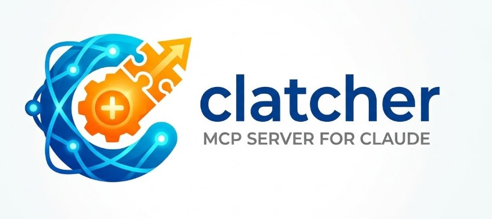
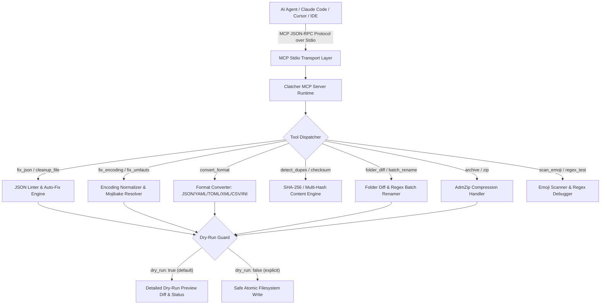
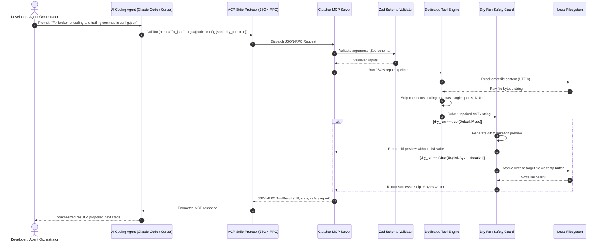

<p align="center">
  
</p>

# ellmos-clatcher-mcp

**🇩🇪 [Deutsche Version](README_de.md)** | **🛡️ [Security Policy](SECURITY.md)** | **📜 [Licenses](THIRD_PARTY_LICENSES.md)** | **📝 [Changelog](CHANGELOG.md)** | **📋 [llms.txt](llms.txt)**

[](https://www.npmjs.com/package/ellmos-clatcher-mcp)
[](https://opensource.org/licenses/MIT)
[](https://nodejs.org/)
[](https://github.com/ellmos-ai/ellmos-clatcher-mcp)
[](https://github.com/ellmos-ai/ellmos-clatcher-mcp/actions/workflows/tests.yml)
[](vitest.config.ts)
[](SECURITY.md)
[](SECURITY.md)
[](SECURITY.md)
[](NOTICE)
[](THIRD_PARTY_LICENSES.md)
[](MARKETING-LOG.txt)
[](CHANGELOG.md)
[](MARKETING-LOG.txt)
[](server.json)
[](glama.json)
[](llms.txt)
[](https://github.com/ellmos-ai)
[](https://github.com/open-bricks)

**Claude Patcher** -- an MCP server that extends AI coding agents with utility tools they don't have natively. File repair, format conversion, duplicate detection, batch operations, and more.

Use Clatcher when your agent needs reliable local maintenance tools for text files, data files, and project folders: repair invalid JSON, normalize encodings, convert formats, compare folders, rename files safely, and verify checksums without leaving the MCP workflow.

> [!NOTE]
> **AI / LLM Integration Note:** All destructive operations (e.g. `batch_rename`, `cleanup_file`, `fix_json`, `fix_encoding`, `fix_umlauts`) default to **dry-run mode** (`dry_run: true`). Autonomous agents must explicitly specify `dry_run: false` to execute mutations on disk.

<a id="sec-01"></a><a id="1-highlights--value-proposition"></a><a id="highlights--value-proposition"></a>
## Highlights & Value Proposition

- **12 Specialized Agent Tools**: Extends Claude Code, Cursor, and MCP agents with utilities they lack out-of-the-box (JSON repair, encoding normalization, format conversion, diffing, deduplication, regex batch renaming).
- **Default Dry-Run Guard**: Mutating tools run in preview mode (`dry_run: true`) by default. Agents must pass `dry_run: false` to write to disk.
- **100% Local-First & Zero-Egress**: Pure local execution over stdio JSON-RPC. No network calls, no cloud telemetry, zero remote attack surface.
- **Atomic File Operations**: All disk modifications write to temporary staging buffers before replacement, preventing corrupt or truncated files.
- **Lossless Encoding Preservation**: Eliminates Windows cp1252 artifacts, BOM headers, and German umlaut Mojibake (`ä, ö, ü, ß`) while guaranteeing pristine UTF-8 bytes.
- **Universal Multi-OS Parity**: Tested continuously across Ubuntu, Windows, and macOS with native path handling and line endings.

## 🧭 Quick Navigation

| # | Section | Focus |
|---|---|---|
| 01 | [✨ Highlights & Value Proposition](#highlights--value-proposition) | 12 essential tools AI agents lack natively: repair, convert, deduplicate, diff, batch |
| 02 | [🎯 Target Personas & Discoverability](#target-personas--discoverability) | Autonomous agents, full-stack developers, release engineers, and security compliance |
| 03 | [⚖️ Comparative Matrix & Alternatives](#comparative-matrix--alternatives) | 10-dimension evaluation vs standard agent shells, ad-hoc jq/sed, desktop apps, cloud APIs |
| 04 | [📐 System Architecture & Data Flow](#system-architecture--data-flow) | 5-tier architecture flowchart TD for stdio transport and repair engines |
| 05 | [🔄 End-to-End Execution Sequence](#end-to-end-execution-sequence) | 14-step dry-run safety sequence diagram from user prompt to verified disk write |
| 06 | [🛡️ Core Invariants & Safety Guarantees](#core-invariants--safety-guarantees) | 10 architectural guarantees ensuring default dry-run, zero-egress, and atomic writes |
| 07 | [🛠️ Tool Surface & Capabilities](#tools) | Deep-dive into all 12 MCP tools with parameter schemas and default preview modes |
| 08 | [⚙️ Installation & Client Setup](#installation) | Seamless setup for Claude Code CLI, Claude Desktop, Cursor, and npm global |
| 09 | [💡 Practical Usage Workflows](#practical-usage-workflows) | Step-by-step agent repair recipes: JSON fix, encoding normalization, batch rename |
| 10 | [🛡️ Dry-Run Protocol & Safety Verification](#dry-run-protocol) | Preview-first verification mechanics and fail-closed disk write controls |
| 11 | [🔤 Encoding, Mojibake & Format Conversion](#encoding-engine) | Lossless UTF-8 normalization, BOM stripping, German umlauts, and format transformations |
| 12 | [💻 Multi-OS Support & Windows Path Robustness](#platform-parity) | Deterministic path handling across Windows CRLF, Linux LF, and macOS runtimes |
| 13 | [🌐 ellmos MCP Family & Sibling Matrix](#ellmos-mcp-family) | 9 sibling MCP servers spanning 200+ specialized agent tools |
| 14 | [🧱 Ecosystem & Partner Suites](#ellmos-ai-ecosystem) | Integration with open-bricks desktop suites, BACH text OS, and dev-bricks tools |
| 15 | [🔒 Security Policy & Incident Reporting](#security-policy) | Bilingual security policy, private vulnerability disclosure, 48h response SLA |
| 16 | [📋 Machine-Readable Context (llms.txt)](#machine-readable-context-llmstxt) | Standardized LLM index for agent discovery and RAG crawlers |
| 17 | [🧪 Verification & Automated Tests](#testing) | 163 Vitest tests, 100% green parity, Multi-OS CI matrix across Node.js 20, 22, 24 |
| 18 | [⚖️ Third-Party Licenses & Transparency](#third-party-licenses--transparency) | 100% permissive Level 1 SBOM, NOTICE attribution, and statutory § 521 BGB disclaimer |

<a id="sec-02"></a><a id="2-target-personas--discoverability"></a><a id="target-personas--discoverability"></a>
## Target Personas & Discoverability

| Persona | Core Needs | Pain Points Solved | Target Discovery Terms |
|---|---|---|---|
| **Autonomous AI Agents & Swarms** | Non-destructive file repair, preview-first dry-runs, deterministic status receipts | Malformed JSON halting agent loops, unhandled encoding Mojibake corrupting project files | `mcp json repair tool`, `local-first mcp file utilities`, `dry-run safe agent tools` |
| **Full-Stack Developers** | Fast multi-format config conversions (JSON/YAML/TOML/XML), regex mass renaming | Cumbersome multi-tool CLI syntax, tedious regex loops, Windows CRLF / BOM pollution | `json to toml mcp`, `yaml xml conversion tool`, `batch regex rename mcp` |
| **DevOps & Release Engineers** | Automated multi-hash checksums (SHA-256/SHA-512), folder diffs, ZIP inspection | CI runner tool drift, unverified package hashes, bloated external archive utilities | `mcp sha256 checksum`, `folder diff mcp tool`, `zip archive mcp runner` |
| **Security & Compliance Officers** | 100% local-first air-gapped stdio execution, zero telemetry, audited permissive licenses | Hidden phone-home telemetry, unknown supply-chain licenses, uncontrolled network egress | `zero-egress mcp server`, `local-first claude mcp`, `permissive license mcp tools` |

<a id="sec-03"></a><a id="3-comparative-matrix--alternatives"></a><a id="comparative-matrix--alternatives"></a>
## Comparative Matrix & Alternatives

| Dimension | ellmos-clatcher-mcp | Standard Agent Shell | Ad-Hoc CLI (jq/sed) | Heavy Desktop Apps | Cloud Converters / APIs |
|---|---|---|---|---|---|
| **Primary Interface** | Native MCP Stdio (JSON-RPC) | Raw Shell / Bash Exec | Standalone Terminal CLI | GUI Application Window | HTTP REST / Web Page |
| **Safety Guardrails** | Built-in `dry_run: true` Default | Blind Overwrite Risk | Unchecked Shell Writes | Manual Confirmation GUI | Remote Server Storage |
| **Data Privacy & Egress** | 100% Local-First / Zero-Egress | Local Execution | Local Execution | Local Execution | Remote Cloud Upload |
| **JSON Auto-Repair** | Heuristic 6-Rule Repair | Re-generate Full File | Complex JQ Scripting | Manual Syntax Editing | Third-Party Web Paste |
| **Encoding Normalization** | Lossless Mojibake Fix | Guesswork / iconv | iconv / enca CLI | Manual File Encoding Chg | Inconsistent Web UTF-8 |
| **Multi-Format Conversion** | JSON/YAML/TOML/XML/CSV/INI | Prompt Re-writing | Separate CLI Packages | Complex File Exports | Rate-Limited Cloud API |
| **Duplicate Detection** | SHA-256 Hash Clustering | None (Custom Script) | Custom bash / find | Standalone Tool (Anti-D) | Not Supported |
| **Batch Regex Renaming** | Dry-Run Staged Renamer | Sequential 'mv' loop | rename / sed Scripts | Bulk Rename GUI Utility | Not Supported |
| **Multi-OS Parity** | Windows, Linux, macOS | Shell Syntax Quirks | Linux-centric Toolsets | OS-Specific Binaries | Browser-Dependent |
| **License & Audited Security** | 100% Permissive MIT / BSD | Variable / Unaudited | GPL / Mixed Toolchains | Mixed / Proprietary | Closed Commercial SaaS |

<a id="sec-04"></a><a id="4-system-architecture--data-flow"></a><a id="system-architecture--data-flow"></a>
## System Architecture & Data Flow

### ASCII Four-View Architectural Topology

```text
+--------------------------------------------------------------------------------------------------+
|                              ELLMOS CLATCHER MCP ARCHITECTURAL TOPOLOGY                          |
+--------------------------------------------------------------------------------------------------+
| [VIEW 1: CALLER RUNTIMES & AGENT CLIENTS]                                                        |
|   * Autonomous Agents   : Claude Code, OpenAI Codex, Antigravity / Gemini, Kimi, Cursor          |
|   * Agent Frameworks    : AutoGen, CrewAI, LangChain, LlamaIndex, Custom Python / TS Clients    |
|   * Transport Protocols : Model Context Protocol (MCP stdio), JSON-RPC 2.0 Framing               |
|   * Tool Surface        : 12 Specialized Agent Tools (file repair, formatting, hash & archives)  |
|   * Schema Contract     : Stdio transport, dynamic runtime Zod schema validation & parameter guards|
+--------------------------------------------------------------------------------------------------+
|                                                |                                                 |
|                                                v                                                 |
+--------------------------------------------------------------------------------------------------+
| [VIEW 2: CLATCHER MCP CORE ENGINE & TOOL DISPATCH ORCHESTRATOR]                                  |
|   * Protocol Dispatch   : ESM stdio router with Zod schema validation & parameter checking      |
|   * Safety Interceptor  : Built-in Dry-Run Guard (INV-DRYRUN-01) defaulting mutating tools to preview|
|   * Fault Diagnostics   : Multi-pass JSON syntax linter & self-healing AST repair pipeline       |
|   * Encoding Resolver   : Lossless UTF-8 normalization, BOM stripper & German umlaut Mojibake fix|
|   * Format Converter    : Bi-directional translation across 6 formats (JSON, YAML, TOML, XML...)|
+--------------------------------------------------------------------------------------------------+
|                                                |                                                 |
|                                                v                                                 |
+--------------------------------------------------------------------------------------------------+
| [VIEW 3: RUNTIME UTILITIES, FORMAT CONVERTERS & ATOMIC REPAIR PIPELINE]                          |
|   * Atomic File Ops     : Staged temporary buffer writes before replacement (INV-ATOMIC-04)      |
|   * Traversal Guard     : Archive extraction & batch rename strictly bounded to root trees       |
|   * Duplication Analysis: Collision-resistant SHA-256 cluster detection across workspace files   |
|   * Cryptographic Hashes: Native multi-algorithm digest verification (SHA-256, SHA-512, MD5, SHA-1)|
|   * Directory Diffs     : Fast recursive folder structural and content delta comparison engine   |
|   * In-Memory Archives  : Streamlined ZIP creation, inspection, and extraction with adm-zip      |
+--------------------------------------------------------------------------------------------------+
|                                                |                                                 |
|                                                v                                                 |
+--------------------------------------------------------------------------------------------------+
| [VIEW 4: AIR-GAP DEFENSE PERIMETER, RUNASINVOKER & ZERO-EGRESS GOVERNANCE]                       |
|   * Execution Privilege : RunAsInvoker unprivileged user-mode (Zero administrative elevation)    |
|   * Transport Boundary  : 100% Local stdio transport, zero telemetry, zero open listening ports  |
|   * Air-Gap Isolation   : 100% Offline execution, zero outbound network sockets, zero egress     |
|   * Statutory Protection: § 521 BGB gratuitous open-source liability disclaimer & 48h SLA        |
|   * Governance & Supply : Level 1 SBOM, 100% permissive runtime (MIT/BSD), NOTICE attribution    |
+--------------------------------------------------------------------------------------------------+
```

### Component Data Flow Diagram


```mermaid
graph TD
    Agent["AI Agent / Claude Code / Cursor / IDE"] -->|"MCP JSON-RPC Protocol over Stdio"| Transport["MCP Stdio Transport Layer"]
    Transport --> Server["Clatcher MCP Server Runtime"]
    Server --> Dispatcher{"Tool Dispatcher"}

    Dispatcher -->|"fix_json / cleanup_file"| JsonEngine["JSON Linter & Auto-Fix Engine"]
    Dispatcher -->|"fix_encoding / fix_umlauts"| EncodingEngine["Encoding Normalizer & Mojibake Resolver"]
    Dispatcher -->|"convert_format"| FormatEngine["Format Converter: JSON/YAML/TOML/XML/CSV/INI"]
    Dispatcher -->|"detect_dupes / checksum"| HashEngine["SHA-256 / Multi-Hash Content Engine"]
    Dispatcher -->|"folder_diff / batch_rename"| FileOpsEngine["Folder Diff & Regex Batch Renamer"]
    Dispatcher -->|"archive / zip"| ArchiveEngine["AdmZip Compression Handler"]
    Dispatcher -->|"scan_emoji / regex_test"| RegexEngine["Emoji Scanner & Regex Debugger"]

    JsonEngine --> DryRunGuard{"Dry-Run Guard"}
    EncodingEngine --> DryRunGuard
    FormatEngine --> DryRunGuard
    FileOpsEngine --> DryRunGuard
    ArchiveEngine --> DryRunGuard

    DryRunGuard -->|"dry_run: true (default)"| PreviewReport["Detailed Dry-Run Preview Diff & Status"]
    DryRunGuard -->|"dry_run: false (explicit)"| DiskWrite["Safe Atomic Filesystem Write"]
```

<a id="sec-05"></a><a id="5-end-to-end-execution-sequence"></a><a id="end-to-end-execution-sequence"></a>
### End-to-End Execution Sequence


```mermaid
sequenceDiagram
    autonumber
    actor User as Developer / Agent Orchestrator
    participant Agent as AI Coding Agent (Claude Code / Cursor)
    participant Stdio as MCP Stdio Protocol (JSON-RPC)
    participant Clatcher as Clatcher MCP Server
    participant Validator as Zod Schema Validator
    participant Engine as Dedicated Tool Engine
    participant Guard as Dry-Run Safety Guard
    participant FS as Local Filesystem

    User->>Agent: Prompt: "Fix broken encoding and trailing commas in config.json"
    Agent->>Stdio: CallTool(name="fix_json", args={path: "config.json", dry_run: true})
    Stdio->>Clatcher: Dispatch JSON-RPC Request
    Clatcher->>Validator: Validate arguments (Zod schema)
    Validator-->>Clatcher: Validated inputs

    Clatcher->>Engine: Run JSON repair pipeline
    Engine->>FS: Read target file content (UTF-8)
    FS-->>Engine: Raw file bytes / string
    Engine->>Engine: Strip comments, trailing commas, single quotes, NULs
    Engine->>Guard: Submit repaired AST / string

    alt dry_run == true (Default Mode)
        Guard->>Guard: Generate diff & mutation preview
        Guard-->>Clatcher: Return diff preview without disk write
    else dry_run == false (Explicit Agent Mutation)
        Guard->>FS: Atomic write to target file via temp buffer
        FS-->>Guard: Write successful
        Guard-->>Clatcher: Return success receipt + bytes written
    end

    Clatcher-->>Stdio: JSON-RPC ToolResult (diff, stats, safety report)
    Stdio-->>Agent: Formatted MCP response
    Agent-->>User: Synthesized result & proposed next steps
```

<a id="sec-06"></a><a id="6-core-invariants--safety-guarantees"></a><a id="core-invariants--safety-guarantees"></a>
## Core Invariants & Safety Guarantees

| Invariant | Guarantee | Enforcement Mechanism |
|---|---|---|
| **Default Dry-Run Guard** | Mutating tools never alter files silently | All modifying tools (`batch_rename`, `cleanup_file`, `fix_json`, `fix_encoding`, `fix_umlauts`, `convert_format`, `archive`) default to `dry_run: true`. Requires explicit `dry_run: false` to commit changes. |
| **Zero-Egress & Local-First** | Zero external telemetry or network calls | 100% offline stdio JSON-RPC processing. No telemetry beacons, no external API requests, zero outbound network sockets. |
| **Path Traversal Guard** | Confined strictly to authorized file trees | Archive and batch operations validate destination boundaries and resolve relative paths safely against base roots. |
| **Atomic Operations** | Resilient against interrupted writes | Modifying pipelines write to staged temporary files before replacing targets, preventing half-written or corrupted outputs. |
| **Non-Elevation User-Mode** | Minimal OS privileges required | Runs entirely inside the executing user's standard permissions without requesting sudo/Administrator privileges. |
| **Encoding Preservation** | Lossless character encoding round-trip | Fixes Windows cp1252 artifacts, BOM issues, and German umlauts (`ä, ö, ü, ß`) while preserving pristine UTF-8 byte order. |
| **Multi-Hash Integrity** | Bit-level cryptographic verification | Checksum validation supporting SHA-256, SHA-512, MD5, and SHA-1 algorithms. |
| **Multi-OS Parity** | Identical behavior across OS platforms | Continuously tested across Linux (`ubuntu-latest`), Windows (`windows-latest`), and macOS (`macos-latest`) with native path separator handling. |
| **Fail-Closed Argument Validation** | Invalid parameters rejected before execution | Zod schema validation enforces strict constraints, rejects malformed paths and types, and prevents partial execution. |
| **Deterministic Error Bounds & Receipts** | Structured diagnostic reporting on all runs | Invariant tool return contracts: every invocation returns structured JSON-RPC payloads, diff previews, byte counts, and verifiable receipts. |

<a id="sec-07"></a><a id="7-tool-surface--capabilities"></a><a id="tools"></a>
## Tools

| Tool | Description |
|---|---|
| `fix_json` | Repair broken JSON: strip comments, trailing commas, single quotes, BOM/NUL |
| `fix_encoding` | Fix encoding issues: BOM removal, double-encoded UTF-8, cp1252 artifacts |
| `fix_umlauts` | Fix broken German umlauts from double-encoding (e.g. `ä` -> `ä`) |
| `convert_format` | Convert between JSON, YAML, TOML, XML, CSV, and INI |
| `detect_dupes` | Find duplicate files by content hash (SHA256), grouped by identical content |
| `folder_diff` | Compare two directories, or take a snapshot and diff on next call |
| `batch_rename` | Rename files using regex patterns, with dry-run preview |
| `archive` | Create, extract, or list ZIP archives |
| `checksum` | Calculate file hashes (SHA256, MD5, SHA1, SHA512) with optional verification |
| `cleanup_file` | Remove BOM, trailing whitespace, fix line endings, strip NUL bytes |
| `scan_emoji` | Find emoji characters in code files |
| `regex_test` | Test regex patterns against text, showing all matches with groups |

All destructive tools default to **dry-run mode** and require explicit `dry_run: false` to write changes.

<a id="sec-08"></a><a id="8-installation--client-setup"></a><a id="installation"></a>
## Installation

### Claude Code CLI

```bash
claude mcp add ellmos-clatcher-mcp -- npx ellmos-clatcher-mcp
```

### Claude Desktop / Cursor Configuration

Add Clatcher to your `claude_desktop_config.json` or Cursor MCP settings:

```json
{
  "mcpServers": {
    "clatcher": {
      "command": "npx",
      "args": ["-y", "ellmos-clatcher-mcp"]
    }
  }
}
```

### npm (global)

```bash
npm install -g ellmos-clatcher-mcp
claude mcp add ellmos-clatcher-mcp -- ellmos-clatcher
```

### From source

```bash
git clone https://github.com/ellmos-ai/ellmos-clatcher-mcp.git
cd ellmos-clatcher-mcp
npm install
npm run build
node dist/index.js
```

<a id="sec-09"></a><a id="9-practical-usage-workflows"></a><a id="practical-usage-workflows"></a>
## Practical Usage Workflows

Clatcher provides deterministic, single-step utility actions tailored for AI coding workflows:

### 1. JSON Auto-Repair (`fix_json`)
Autonomous agent runs often stumble upon configuration files with trailing commas, single-quoted keys, or inline JavaScript comments:
```json
{
  "name": "fix_json",
  "arguments": {
    "path": "tsconfig.json",
    "dry_run": false
  }
}
```
*Result:* Comments and trailing commas are parsed and stripped, producing strict, spec-compliant JSON with verifiable bytes written.

### 2. Lossless Character Encoding Normalization (`fix_encoding` / `fix_umlauts`)
Fixes Windows cp1252 artifacts, BOM headers, and double-encoded UTF-8 sequences without data loss:
```json
{
  "name": "fix_umlauts",
  "arguments": {
    "path": "docs/Anleitung.md",
    "dry_run": false
  }
}
```
*Result:* Corrupted sequences like `ä`, `ö`, `ü`, `ß` are converted back to clean UTF-8 `ä`, `ö`, `ü`, `ß`.

### 3. Multi-Format Configuration Conversion (`convert_format`)
Converts structured data between JSON, YAML, TOML, XML, CSV, and INI in a single pass:
```json
{
  "name": "convert_format",
  "arguments": {
    "source_path": "config.yaml",
    "target_format": "json",
    "dry_run": false
  }
}
```

### 4. Duplicate Detection & Cryptographic Hashing (`detect_dupes` / `checksum`)
Scans target directory trees to identify identical content using SHA-256 hash clustering without transmitting data over the network:
```json
{
  "name": "detect_dupes",
  "arguments": {
    "directory": "src/assets"
  }
}
```

### 5. Safe Regex Batch Renaming (`batch_rename`)
Preview and stage batch file renames with regex patterns:
```json
{
  "name": "batch_rename",
  "arguments": {
    "directory": "reports",
    "pattern": "^draft_(.*)\\.txt$",
    "replacement": "final_$1.txt",
    "dry_run": true
  }
}
```

<a id="sec-10"></a><a id="10-dry-run-protocol--safety-verification"></a><a id="dry-run-protocol"></a>
## Dry-Run Protocol & Safety Verification

All mutating tools in `ellmos-clatcher-mcp` enforce a **preview-first contract** (`dry_run: true` by default):

1. **Safety Preview:** Invoking `fix_json`, `cleanup_file`, `batch_rename`, `fix_encoding`, or `archive` without arguments returns a detailed unified diff and mutation preview without touching the disk.
2. **Explicit Opt-In:** Filesystem writes occur only when the agent explicitly supplies `dry_run: false`.
3. **Fail-Closed Argument Validation:** Path parameters are strictly sanitized against path traversal (`..` escapes) and bounded by project directory constraints.
4. **Receipt Generation:** Every modifying run produces an authoritative JSON receipt detailing bytes read, bytes written, and cryptographic verification status.

<a id="sec-11"></a><a id="11-encoding-mojibake--formatting-engine"></a><a id="encoding-engine"></a>
## Encoding, Mojibake & Format Conversion

Clatcher incorporates specialized string manipulation primitives to resolve cross-platform text corruption:
- **BOM Stripping:** Automatically removes UTF-8 BOM headers (`0xEF, 0xBB, 0xBF`) that break legacy CLI parsers and CI linters.
- **Mojibake Resolution:** Reconstructs corrupted multi-byte sequences resulting from ISO-8859-1 or Windows-1252 interpretations of UTF-8 text.
- **Line Ending Standardization:** Converts mixed Windows CRLF (`\r\n`) and Unix LF (`\n`) files into consistent line feeds.
- **NUL-Byte Removal:** Sanitizes accidental binary NUL characters injected by interrupted network streams or corrupted disk blocks.

<a id="sec-12"></a><a id="12-multi-os-support--windows-path-robustness"></a><a id="platform-parity"></a>
## Multi-OS Support & Windows Path Robustness

Cross-platform parity is verified continuously on Linux, macOS, and Windows:
- **Path Normalization:** Resolves backslashes (`\`) and forward slashes (`/`) transparently using native Node.js `path` modules.
- **Long Path Support:** Safely operates on Windows deep nested structures without MAX_PATH (260 character) truncation.
- **Unprivileged Execution:** Operates under standard user rights (`RunAsInvoker`), requiring no administrative elevation or root access.

<a id="sec-13"></a><a id="13-ellmos-mcp-family--sibling-matrix"></a><a id="ellmos-mcp-family"></a>
## ellmos MCP Family & Sibling Matrix

Part of the **ellmos MCP family**:

| Server | Tools | Focus | npm |
|---|---|---|---|
| [ellmos-filecommander-mcp](https://github.com/ellmos-ai/ellmos-filecommander-mcp) | 50 | Filesystem operations, process management, interactive sessions | [`ellmos-filecommander-mcp`](https://www.npmjs.com/package/ellmos-filecommander-mcp) |
| [ellmos-codecommander-mcp](https://github.com/ellmos-ai/ellmos-codecommander-mcp) | 22 | Code analysis, AST parsing, import management | [`ellmos-codecommander-mcp`](https://www.npmjs.com/package/ellmos-codecommander-mcp) |
| **[ellmos-clatcher-mcp](https://github.com/ellmos-ai/ellmos-clatcher-mcp)** | **12** | **Utility tools: repair, convert, detect, batch ops** | **[`ellmos-clatcher-mcp`](https://www.npmjs.com/package/ellmos-clatcher-mcp)** |
| [n8n-manager-mcp](https://github.com/ellmos-ai/n8n-manager-mcp) | 19 | n8n workflow management via AI assistants | [`n8n-manager-mcp`](https://www.npmjs.com/package/n8n-manager-mcp) |
| [ellmos-controlcenter-mcp](https://github.com/ellmos-ai/ellmos-controlcenter-mcp) | 34 | MCP stack discovery, profile management, control plane | [`ellmos-controlcenter-mcp`](https://www.npmjs.com/package/ellmos-controlcenter-mcp) |
| [ellmos-homebase-mcp](https://github.com/ellmos-ai/ellmos-homebase-mcp) | 51 | LLM memory, knowledge, state, routing, and orchestration | [`ellmos-homebase-mcp`](https://www.npmjs.com/package/ellmos-homebase-mcp) (alpha) |
| [ellmos-servercommander-mcp](https://github.com/ellmos-ai/ellmos-servercommander-mcp) | 8 | Server operations: deploy dry-runs, mail status, log analysis, health checks | [`ellmos-servercommander-mcp`](https://www.npmjs.com/package/ellmos-servercommander-mcp) (alpha) |
| [ellmos-blender-use-mcp](https://github.com/ellmos-ai/ellmos-blender-use-mcp) | 4 | Headless Blender asset QA and FBX reimport verification | [`ellmos-blender-use-mcp`](https://www.npmjs.com/package/ellmos-blender-use-mcp) (alpha) |
| [open-compute-mcp](https://github.com/ellmos-ai/open-compute-mcp) | 16 | Model-agnostic computer use: capture, safety-gated actions, Windows UIA | [`open-compute-mcp`](https://www.npmjs.com/package/open-compute-mcp) (alpha) |

Each server covers a different domain. Use one server, a focused pair, or the full family depending on your workflow.

<a id="sec-14"></a><a id="14-ecosystem--partner-suites"></a><a id="ellmos-ai-ecosystem"></a>
## ellmos-ai Ecosystem

This MCP server is part of the **[ellmos-ai](https://github.com/ellmos-ai)** ecosystem — AI infrastructure, MCP servers, and intelligent tools.

### AI Infrastructure

| Project | Description |
|---------|-------------|
| [BACH](https://github.com/ellmos-ai/bach) | Local-first text-based OS for LLM agents — 113+ handlers, 550+ tools, SQLite memory |
| [open-compute](https://github.com/ellmos-ai/open-compute) | Model-agnostic computer-use core powering Open Compute MCP |
| [clutch](https://github.com/ellmos-ai/clutch) | Provider-neutral LLM orchestration with auto-routing and budget tracking |
| [rinnsal](https://github.com/ellmos-ai/rinnsal) | Lightweight agent memory, connectors, and automation infrastructure |
| [ellmos-stack](https://github.com/ellmos-ai/ellmos-stack) | Self-hosted AI research stack (Ollama + n8n + Rinnsal + KnowledgeDigest) |
| [MarbleRun](https://github.com/ellmos-ai/MarbleRun) | Autonomous agent chain framework for Claude Code |
| [gardener](https://github.com/ellmos-ai/gardener) | Minimalist database-driven LLM OS prototype (4 functions, 1 table) |
| [ellmos-tests](https://github.com/ellmos-ai/ellmos-tests) | Testing framework for LLM operating systems (7 dimensions) |

### Desktop Software & Sibling Ecosystem

Our partner organization **[open-bricks](https://github.com/open-bricks)** and sister suites bundle AI-native applications and developer tooling:

| Repository | Focus | Status |
|---|---|---|
| [file-bricks/ProFiler](https://github.com/file-bricks/ProFiler) | Multi-column PySide6 desktop file manager with smart workspaces | Active |
| [doc-bricks/DokuZen](https://github.com/doc-bricks/DokuZen) | Document conversion, batch OCR, metadata sanitization | Active |
| [dev-bricks/safe-start-for-codex](https://github.com/dev-bricks/safe-start-for-codex) | Secure workspace preflight and agent bootstrap gates | Active |
| [dev-bricks/DevCenter](https://github.com/dev-bricks/DevCenter) | Central development cockpit and service manager | Active |
| [dev-bricks/CodeBox](https://github.com/dev-bricks/CodeBox) | Sandboxed code execution and containerized worker environment | Active |

<a id="sec-15"></a><a id="15-security-policy--incident-reporting"></a><a id="security-policy"></a>
## Security Policy

For security vulnerability disclosure channels, supported versions, and our 48-hour response SLA, refer to **[SECURITY.md](SECURITY.md)**.

<a id="sec-16"></a><a id="16-machine-readable-context-llmstxt"></a><a id="machine-readable-context-llmstxt"></a>
## Machine-Readable Context (llms.txt)

This repository provides a standardized machine-readable context file for AI agents, crawlers, and RAG indexers:
- **[llms.txt](llms.txt)**: Concise manifest of all 12 tools, dry-run safety invariants, sibling MCP tool counts, and CLI invocation examples.

<a id="sec-17"></a><a id="17-testing-verification--quality-gates"></a><a id="testing"></a>
## Testing

```bash
npm test
```

168 tests covering all 12 tools, i18n language packs, repository hygiene, and metadata consistency (vitest). The GitHub Actions workflow runs `npm ci`, TypeScript build, Vitest, and an npm package dry-run on Node.js 20, 22, and 24.

### Requirements

- Node.js >= 20

### License

[MIT](LICENSE)

<a id="sec-18"></a><a id="18-third-party-licenses--transparency"></a><a id="third-party-licenses--transparency"></a><a id="haftung--liability"></a>
## Third-Party Licenses & Transparency

`ellmos-clatcher-mcp` adheres strictly to open-bricks and ellmos-ai open-source governance standards. All 7 direct runtime dependencies and 5 development dependencies are 100% permissively licensed (MIT, BSD-3-Clause, BSD-2-Clause, Apache-2.0) with zero copyleft (0% GPL/AGPL) and zero cloud telemetry.

Formal copyright notice and ecosystem attribution are codified in **[`NOTICE`](NOTICE)**. For the comprehensive dependency inventory, SPDX identifiers, Level 1 SBOM cross-reference matrix, and full license texts, see **[THIRD_PARTY_LICENSES.md](THIRD_PARTY_LICENSES.md)** and the plain-text companion **[THIRD_PARTY_LICENSES.txt](THIRD_PARTY_LICENSES.txt)**.

## Discoverability

- **npm:** [`ellmos-clatcher-mcp`](https://www.npmjs.com/package/ellmos-clatcher-mcp)
- **GitHub:** [`ellmos-ai/ellmos-clatcher-mcp`](https://github.com/ellmos-ai/ellmos-clatcher-mcp)
- **MCP Registry metadata:** [`server.json`](server.json) declares the official `io.github.ellmos-ai/ellmos-clatcher-mcp` package identity.
- **Glama.ai Registry:** [`glama.json`](glama.json) manifest for Glama MCP ecosystem.
- **LLM index:** [`llms.txt`](llms.txt) summarizes the tool surface for agents and registry crawlers.

Primary search terms: `ellmos-clatcher-mcp`, `clatcher mcp`, `claude patcher`, `mcp json repair server`, `mcp encoding fix`, `model context protocol file repair`, `claude code utility tools`, `format conversion mcp tool`, `duplicate file detection mcp`, `batch rename mcp`, `checksum mcp`, `zip archive mcp`.

## Changelog

For the complete release evolution, version notes, and hygiene audits, see **[CHANGELOG.md](CHANGELOG.md)**.

## Haftung / Liability

Dieses Projekt ist eine **unentgeltliche Open-Source-Schenkung** im Sinne der §§ 516 ff. BGB. Die Haftung des Urhebers ist gemäß **§ 521 BGB** auf **Vorsatz und grobe Fahrlässigkeit** beschränkt. Ergänzend gilt der Gewährleistungsausschluss der MIT-Lizenz.

Nutzung auf eigenes Risiko. Keine Wartungszusage, keine Verfügbarkeitsgarantie, keine Gewähr für Fehlerfreiheit oder Eignung für einen bestimmten Zweck.

This project is an unpaid open-source donation under German law. Liability is limited to intent and gross negligence (§ 521 German Civil Code). The MIT License warranty disclaimer applies.

Use at your own risk. No warranty, no maintenance guarantee, no availability guarantee, and no fitness-for-purpose assumed.
